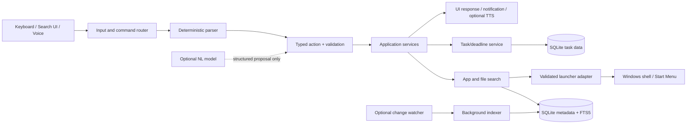

# MyAssistant — Project Architecture and Development Specification

**Document version:** 1.3
**Last updated:** 2026-10-03 (Asia/Katmandu)
**Project status:** Phases 2–8 implemented; speech acceptance, optional AI decision, reliability review and release packaging remain open.
**Document status:** CPython 3.14.8, PySide6 6.11.2, tzdata 2026.4, pytest 9.1.1 and PyInstaller 6.22.3 are installed. 66 tests pass; one symlink test is skipped because this Windows environment does not permit symlink creation. A Windows one-folder build completed and starts from an isolated working directory; microphone/speaker and clean-machine checks need interactive verification.

This document is the project’s source of truth. The status terms used here mean:

| Term | Meaning |
|---|---|
| Planned | A requirement or roadmap item, not yet designed in implementation detail. |
| Designed | The intended behavior or architecture is described here. |
| Implemented | Code exists in this repository. |
| Tested | The behavior has been exercised by an identified test or verification. |
| Experimental | A prototype exists but is not a supported product behavior. |
| Future | Deferred beyond the current planned phases. |

## 1. Executive summary

MyAssistant is a personal, local-first Windows desktop assistant. The intended product combines a fast keyboard launcher, configurable file and application search, task/deadline tracking, reminders, and later optional voice input, speech output and natural-language interpretation. It is intended to be a cohesive modular application rather than a collection of scripts.

The repository contains the application foundation, PySide6 launcher, Start Menu application discovery, configured-root file/folder search, task/deadline management, Windows hotkey/tray/reminders, local speech adapters and an optional startup greeting. The pinned local model is present. Remaining work is acceptance testing on the desktop, an explicit decision on optional AI, reliability polish and a clean-machine release check. The whole-stack audit and implementation updates are in [docs/TECHNOLOGY_EVALUATION.md](docs/TECHNOLOGY_EVALUATION.md).

## 2. Problem, goals and non-goals

### Problem

Opening applications and locating personal files across configurable locations takes repeated navigation. Keeping tasks and deadlines visible is a separate workflow. The desired assistant unifies those everyday actions behind keyboard, search, desktop UI and eventually voice.

### Goals

- Provide a quick, global-shortcut launcher for applications, files, folders and supported commands.
- Build a local, configurable filesystem metadata index rather than walking every drive on every keystroke.
- Open a unique, high-confidence result; show choices when a match is ambiguous.
- Manage persisted tasks, priorities, deadlines, project paths, tags and completion state.
- Display live countdowns and reminders using real timezone-aware timestamps.
- Offer tray, startup and notification integrations under user control.
- Keep UI responsive and isolate Windows, database, voice and AI dependencies behind replaceable interfaces.
- Preserve local-first privacy and a controlled action boundary.

### Non-goals for the initial product

- Replacing Windows Search, PowerToys Run, a general-purpose task manager or a full conversational AI.
- Continuously scanning whole drives or indexing file contents by default.
- Executing arbitrary shell commands from text, speech or a model.
- Requiring cloud speech, cloud AI, paid subscriptions, an NVIDIA GPU, or an administrator account for ordinary features.
- Building a complete product or production `.exe` during the architecture phase.

## 3. Platform, environment and project state

### Target platform

Windows 10/11 desktop is the intended initial platform; exact minimum Windows release must be chosen before packaging. Runtime must not depend on VS Code. The source checkout is currently `C:\MyAssistant`.

### Inspected development machine (2026-10-02)

| Item | Observation | Confidence/limit |
|---|---|---|
| OS | Windows build 26100 | PowerShell host version and successful Windows executables; WMI OS query was denied. Build commonly corresponds to Windows 11 24H2, but this association was not independently confirmed here. |
| Python | CPython 3.14.8 x64 in system and `.venv` interpreters | Directly checked after the audit; `Py_GIL_DISABLED=0`. `.python-version` and `pyproject.toml` target 3.14.8. |
| Git | 2.53.0.windows.3 | Direct command output. Repository is on `main` with no commits yet. |
| Node.js | 24.18.0 | Detected; not part of the proposed runtime stack. |
| CPU | Intel family 6, model 140 from Python platform output | Exact marketing model/core count could not be obtained because WMI queries were denied. |
| RAM | Not independently measured | WMI access denied. The task brief mentions 16 GB; retain that as user-provided context until setup can verify it. |
| GPU | NVIDIA GeForce MX330, 2,048 MiB VRAM | `nvidia-smi`; driver 581.95; it reports CUDA 13.0 driver compatibility. This does not mean the CUDA toolkit or compatible inference libraries are installed. |
| CUDA toolkit | Not confirmed | `nvidia-smi` reports driver capability only. |

The whole-stack audit recommends **standard CPython 3.14.8 x64**. The system and `.venv` interpreters now report 3.14.8 x64 with the GIL enabled. PySide6 6.11.2 and pytest 9.1.1 have been installed into `.venv`; no speech models or CUDA packages were installed. Use 3.13.16 only if an essential later-selected native dependency demonstrably blocks 3.14. Do not use free-threaded 3.14t for the initial project. See [docs/TECHNOLOGY_EVALUATION.md](docs/TECHNOLOGY_EVALUATION.md) for evidence and the final recommended stack.

### Existing repository status

The initial inspection description above was historical and is superseded by the current implementation status and roadmap. The repository now has a `pyproject.toml`, project documentation, feature modules under `core/`, `launcher/`, `search/`, `system/`, `todo/`, `ui/` and `voice/`, and automated tests under `tests/`.

## 4. Users and use cases

The primary user is one Windows laptop/desktop owner who wants local access to applications, project files and personal tasks. Future contributors need enough structure to change an engine without changing domain behavior. Administrators need a clear account of permissions, startup effects, persisted data and package contents.

Representative flows:

1. Press the configured shortcut, type `chrome`, use arrows, press Enter; Escape closes the launcher.
2. Type `python project`; see ranked files/folders/apps. If multiple projects are plausible, choose one rather than opening an arbitrary path.
3. Ask to open Downloads; resolve a known folder or a search result through the same validated launcher.
4. Add a task with a deadline and optional project path; see its remaining duration and receive configurable reminders.
5. Later, speak “Open my Python project”; speech becomes text, a parser produces a typed action, and the same search and confirmation rules apply.

## 5. Functional requirements

| ID | Requirement | Status |
|---|---|---|
| F-01 | Global configurable shortcut opens a search window over other applications. | **Implemented:** Win32 global hotkey opens and focuses the launcher; conflict reporting is supported. Interactive conflict checks remain. |
| F-02 | Search apps, files, folders, names, paths and supported commands; arrow/Enter/Escape keyboard navigation. | **Implemented for apps and indexed files/folders:** Home has separate scopes and keyboard navigation; natural-language commands remain deferred. |
| F-03 | Configurable indexed roots; initial suggested roots are C: and D:, never permanent hard-coded assumptions. | **Implemented:** opt-in absolute roots via `MYASSISTANT_INDEX_ROOTS`; no drive is indexed by default. |
| F-04 | Maintain metadata index; handle errors, hidden/system paths, symlinks, deletion and rename reconciliation, exclusions, large trees. | **Implemented with limits:** background bounded batches, hidden/system and symlink skipping, path exclusions, error/cancellation-safe stale pruning and FTS5 search. Large-tree performance and richer progress/cancellation controls need field measurement. |
| F-05 | Discover applications from Start Menu shortcuts, known locations and user-configured paths. | **Partially implemented:** Start Menu `.lnk` discovery; known install locations/configured roots remain planned. |
| F-06 | Launch apps/files/folders through dedicated validated adapters. | **Implemented:** selected catalog shortcuts and indexed paths are revalidated before opening. |
| F-07 | Ambiguous or low-confidence targets require user selection. | **Implemented:** equally ranked matches are presented for explicit user selection. |
| F-08 | Task CRUD, completion/reopen, filtering/search, priority, tags and optional project path. | **Implemented:** SQLite service and Tasks tab support add/edit/delete, open/completed filters, text search, priorities, tags and absolute project paths. |
| F-09 | Timezone-aware countdown, past-due and completed-task behavior, restart-safe reminders. | **Implemented:** aware deadlines are stored in UTC with an IANA timezone ID; DST gaps/overlaps are handled explicitly; countdowns recalculate from UTC; reminder windows have persistent deduplication records and tray message delivery. |
| F-10 | Moveable/resizable task widget, tray, optional topmost, configurable appearance and notifications. | Future |
| F-11 | Optional Windows startup and spoken task greeting; greeting and startup independently configurable. | **Implemented:** Settings toggles the per-user Windows Startup entry and optional Windows SAPI greeting with open-task counts and up to three upcoming deadlines; both are off by default. Interactive speech and sign-in verification remain. |
| F-12 | Replaceable offline speech recognition and text-to-speech. | **Implemented; hardware acceptance pending:** push-to-talk, pinned CPU/int8 faster-whisper and Windows SAPI output are available. |
| F-13 | Optional natural-language model returns allowlisted structured actions only. | **Deferred by ADR-008:** no provider or model has been selected; existing deterministic search and task UI remain usable without an LLM. |

## 6. Non-functional requirements

- **Responsiveness:** search UI remains interactive during indexing, storage, speech or network work. Use Qt worker threads/processes and bounded queues; never run a full walk or model inference on the UI thread.
- **Speed:** normal indexed queries should feel instantaneous. Establish numeric latency and index-size targets after measuring representative data.
- **Reliability:** inaccessible folders or one failed application launch do not crash the process; report actionable errors and continue.
- **Privacy:** local metadata and audio stay local by default. Never send an entire index or raw audio to a cloud service by default.
- **Security:** narrow allowlisted actions, validated paths, parameterized database queries, no arbitrary shell. Require confirmation for destructive operations (which are not part of the initial command set).
- **Maintainability:** modular domain/application/platform boundaries; migrations; pinned dependencies; written decisions; isolated tests.
- **Accessibility:** keyboard-first interaction, readable focus states and sensible scaling; verify with actual UI testing.
- **Resource use:** avoid persistent large speech models unless voice is enabled; support CPU-only mode.

## 7. System architecture

### Logical components



### Boundaries

- **Presentation (`ui`)** owns Qt widgets, user interaction and rendering. It calls application services and receives typed results/signals.
- **Application (`core`, `todo`)** owns orchestration, policies, command types, matching thresholds and task/deadline rules; it does not import Qt or call shell APIs directly.
- **Infrastructure (`database`, `search`, `system`, `launcher`, `voice`)** provides persistence, OS adapters, indexes and engine implementations behind explicit interfaces.
- **Composition root (`main.py`)** creates configuration, logging, services, adapters and UI, then owns application lifecycle and shutdown.

## 8. Component architecture and data flows

### Search and opening

1. UI sends normalized text to a search service with cancellation and a result limit.
2. Search fans out to application catalog, known-folder aliases and filesystem metadata index.
3. Ranking combines exact/prefix/token/path match, file type, app priority, recency/frequency (only after consent/policy), and freshness. Avoid reporting ambiguous top scores as unique matches.
4. Before opening, recheck existence and target type. A selected result passes to a dedicated Windows shell adapter; errors are returned to the UI.

### Index lifecycle

Configured roots and exclusions drive a cancellable background traversal. The current implementation stores path, parent, name, extension, directory flag, modified time and file size; it does not yet store stable file identity. Access-denied and transient errors are counted without aborting all roots. Hidden/system entries and symlinks are skipped; stale rows are removed only after a root finishes without traversal errors. Writes are batched in groups of 250. A separate Qt worker connection keeps scans off the UI thread. FTS5 searches names and paths, not file contents. Root selection and extra absolute exclusions are configured with `MYASSISTANT_INDEX_ROOTS` and `MYASSISTANT_INDEX_EXCLUSIONS`, using Windows `;` separators. No roots are indexed by default. Current scan runs at application startup when roots are configured; performance on large trees and routine rescan policy need further review.

### Windows shell integration

The application registers `Ctrl+Alt+M` globally by default using Win32 `RegisterHotKey`; override it with `MYASSISTANT_GLOBAL_HOTKEY` using a modifier plus one key (for example `Ctrl+Alt+M`). Windows may reject a chord already registered by another program; the app logs the conflict and remains usable. The tray menu opens the launcher, checks task reminders and exits. Closing hides the window when a system tray is available, and exits if there is no tray. Task reminder delivery is checked on startup and every 30 seconds; a reminder delivery record is saved only when tray message support is available. Windows sign-in startup and the spoken task greeting are separately configurable in Settings and off by default. The greeting uses Windows SAPI to announce the open-task count, overdue count and up to three upcoming deadlines; it uses no microphone or network model. `MYASSISTANT_START_WITH_WINDOWS=true` remains available for scripted setup. The source-based startup entry must be adapted for packaged distribution.

The first proposal is an explicit walker plus persisted metadata/FTS5. Compare it with Windows Search and NTFS USN Journal before investing in incremental infrastructure. A later hybrid may use `watchdog` or USN to mark roots dirty and periodic reconciliation to recover missed events. Windows Search can only cover indexed scopes and may not meet user-controlled exclusion/ranking needs. USN is NTFS-specific and requires careful journal-wrap and identity handling; it is not the Phase 0 implementation choice.

### Applications

Discover Start Menu `.lnk` entries via Windows shell locations and known/registered application metadata, plus configured paths. Resolve shortcuts through a Windows-aware adapter, retain display name and launch target, de-duplicate, and refresh separately from user search. Do not guess install locations as a correctness guarantee. Launch a chosen result via a shell/open-document API or safe process argument list; avoid building shell command strings.

### Task/deadline flow

The Tasks tab calls `TaskService` methods; create/update and tag changes are transactional. Deadlines are entered as a local wall time plus configured IANA timezone (`MYASSISTANT_TIMEZONE`, default `UTC`), then stored as a UTC instant and timezone ID. Nonexistent DST times are rejected; repeated times require choosing the first or second occurrence. Countdown display recalculates from UTC every 30 seconds, so sleep/restart/time changes do not accumulate drift. Past due displays “Deadline passed”; completed tasks display “Completed”. Reminder windows (one hour, 15 minutes and overdue by default) are deduplicated in SQLite using deadline-specific keys, then delivered through tray messages when available. Windows does not provide IANA zone data to this Python runtime, so `tzdata` supplies that database.

### Voice and TTS

Implemented speech pipeline: explicit Record/Stop → temporary WAV capture and normalization → replaceable recognizer → transcript preview → explicit SAPI speech output. Voice recognition does not trigger actions. The optional startup greeting summarizes open task deadlines through the same Windows speech adapter. The pinned model runs locally on CPU/int8; no microphone or model work occurs unless the user requests it. Wake-word capture remains out of scope.

### Optional AI

The deterministic parser handles obvious commands (`open chrome`, `show tasks`). An optional natural-language adapter can map an utterance to a schema such as `{ "action": "open_folder", "target": "Python project" }`. Validate schema, allowed action, target policy, authorization and ambiguity in normal application code. Model text is data, never Python, PowerShell, shell, SQL or executable path instructions. The AI layer can ask a clarifying question; it cannot launch directly.

## 9. Technology research and selection

Research checked on 2026-10-02. Versions and repository status change; repeat this review before dependency pinning and every release. The detailed compatibility matrix, installation timing and Python recommendation are in [docs/TECHNOLOGY_EVALUATION.md](docs/TECHNOLOGY_EVALUATION.md). Links below point to primary project/vendor documentation where possible.

### GUI

| Candidate | Current evidence | Trade-off | Recommendation |
|---|---|---|---|
| PySide6 / Qt for Python | Official Qt binding; 6.11.2 installed in `.venv`, with Windows x64 `cp310-abi3` wheel. Qt licensing offers LGPLv3/GPLv3 or commercial terms. [Docs](https://doc.qt.io/qtforpython-6/), [release](https://www.qt.io/blog/qt-for-python-release-6.11-is-out), [release index](https://download.qt.io/official_releases/QtForPython/pyside6/) | Mature widgets/event loop and Qt worker patterns; relatively large packaged footprint and license obligations. GUI runtime/package smoke checks remain. | **Selected and installed.** Best fit for native-feeling, modular Python desktop UI. |
| PyQt6 | Maintained Qt binding, GPL/commercial licensing. | Similar Qt capability; commercial redistribution can be less convenient than LGPL-compliant PySide use. | Consider if a specific module/support need outweighs licensing fit. |
| Tkinter | Standard-library Tk wrapper. | Easy bootstrap and no separate GUI package, but less suitable for polished launcher, tray, widget styling and app-wide patterns. | Not selected for full product. |
| Tauri/Electron | Web UI hosted in desktop shell. | Capable UI ecosystem, but adds frontend runtime/toolchain and cross-language boundary. Electron is especially heavy for a lightweight Python-first app. | Not selected for initial stack. |

**Compatibility result:** PySide6 6.11.2 supplies a Windows x64 `cp310-abi3` wheel, compatible with standard CPython 3.14, and has been installed in the project `.venv`. CPython 3.14.8 x64 is the selected baseline. GUI and later-selected audio stack smoke checks remain for the relevant implementation phases. Python 3.13 is a fallback, not the preferred pin absent a demonstrated blocker.

### Speech-to-text (Phase 8 implementation)

| Candidate | Current evidence | Strengths | Constraints and fit |
|---|---|---|---|
| faster-whisper | **Selected:** faster-whisper 1.2.1 + CTranslate2 4.8.2; both installed as optional `voice` extra. Native CPython 3.14 Windows x64 wheel verified by installation/import. [Project](https://github.com/SYSTRAN/faster-whisper), [CTranslate2 wheel](https://pypi.org/project/ctranslate2/4.8.2/) | Local multilingual transcription with CPU int8; Py3 API. | The app captures explicitly and stores audio only in a temporary WAV deleted after transcription. CPU is mandatory; GPU is not used. One-time model download needed before offline use. |
| whisper.cpp | Active `ggml-org` project; current observed release v1.9.4; Windows release workflows and CUDA backends are present. [Releases](https://github.com/ggml-org/whisper.cpp/releases), [project](https://github.com/ggml-org/whisper.cpp) | Native CPU quantization, offline, Windows support and optional CUDA; avoids requiring a large Python ML stack. | Integration is via native library/CLI bindings; ship and audit native binaries/model licenses. GPU support still has CUDA deployment details. |
| Vosk | Python package metadata shows 0.3.75, Windows x64 support and Apache-2.0 API. [Setup](https://github.com/alphacep/vosk-api/blob/master/python/setup.py), [license](https://github.com/alphacep/vosk-api/blob/master/COPYING) | Offline, streaming-oriented, relatively light CPU use, no GPU needed. | Model accuracy/language/model sizes vary; package/release cadence should be verified at selection time. |
| Windows speech APIs | Windows exposes installed speech facilities, but API availability and speech-recognition support differ between WinRT/SAPI generations and language packs. | No external model distribution when available; close Windows integration. | Must prove a supported desktop Python integration and actual local language/device availability; do not assume it is a universal recognizer. |

**Selected initial path:** optional `sounddevice` 0.5.6 capture + `faster-whisper` 1.2.1 / CTranslate2 4.8.2, running multilingual tiny on CPU int8. The model is MIT licensed and pinned to revision `d90ca5fe260221311c53c58e660288d3deb8d356`. Its required files are present under `%LOCALAPPDATA%\MyAssistant\models\faster-whisper-tiny` (about 77 MB model.bin). The app has push-to-talk, a 60 second cap, converts microphone input to 16 kHz, and deletes the temporary WAV after transcription. It presents a transcript preview and does not execute recognized text. Step 2 local transcription was reported successful after pinning PyAV 18.1.0. Physical microphone capture and audible output have not been confirmed in this project record. CPU is mandatory; CUDA/GPU remains deferred for this 2 GB MX330.

### Text-to-speech (Phase 8 implementation)

| Candidate | Evaluation | Recommendation |
|---|---|---|
| Installed Windows voices using SAPI via pywin32 | **Selected:** pywin32 312, optional voice extra; CPython 3.14 Windows x64 wheel installed. [PyPI](https://pypi.org/project/pywin32/312/), [Microsoft Speech API](https://learn.microsoft.com/en-us/previous-versions/windows/desktop/ms723627(v=vs.85)) | Local, no model or network. COM is initialized on the background worker and speech starts only when the user selects Speak. A read-only enumeration found two installed voices; audible output still needs a user-facing smoke check. |
| Piper | Historically lightweight/offline and voice choices exist, but original `rhasspy/piper` repo was archived 2025-10-06. Its code license does not automatically settle individual voice/model rights. [Archive/releases](https://github.com/rhasspy/piper/releases), [voice list](https://github.com/rhasspy/piper/blob/master/VOICES.md) | Not the default. Reassess active forks, model lineage and license before adoption. |
| Cloud TTS | Potentially natural and simple API use. | Future optional provider only; adds network, recurring cost and voice-data disclosure. |

All implementations must conform to a replaceable `TextToSpeech` interface and support a no-speech configuration.

### Filesystem indexing and query

| Candidate | Benefits | Limits | Direction |
|---|---|---|---|
| Python `os.scandir` walker | Transparent, no extra package, testable on temporary roots, configurable. | First scan costs time; no automatic delta feed. | Proposed first prototype, bounded to configured roots and off the UI thread. |
| Windows Search | OS-maintained index and rich properties for indexed locations. | Coverage is controlled by Windows indexing settings; API integration/query semantics complicate consistent scope, ranking and exclusions. | Prototype/benchmark alternative; do not depend on it as sole source. |
| NTFS USN Change Journal | Efficient record of file metadata changes on NTFS. Microsoft documents querying journal state. [API](https://learn.microsoft.com/en-us/windows/win32/api/winioctl/ni-winioctl-fsctl_query_usn_journal) | NTFS-only, low-level volume access, journal can wrap, identity/reconciliation and permissions add complexity. | Defer until a walker is measured; consider as optional incremental source. |
| `watchdog` events | Convenient cross-platform observer abstraction. | Native event buffers can overflow; event coverage and network/removable filesystems vary; still needs reconciliation. | Optional dirty-root hint, never sole consistency mechanism without recovery. |
| SQLite FTS5 | Embedded full-text indexes, prefix/phrase queries and BM25 ranking. [SQLite FTS5](https://www.sqlite.org/fts5.html) | Confirmed in the active SQLite 3.50.4 build; it indexes metadata text, not live filesystem truth. | Selected and implemented for file/folder name and path retrieval. |

Do not index file content. Initial metadata rows contain names and filesystem properties, not content or previews. Indexing has no default roots; users provide absolute roots and optional absolute excluded subfolders. Hidden/system entries and symlinks are skipped. Exclusions apply to the selected path and descendants; excluded paths may otherwise contain desired items, so show the effective scope clearly.

### Hotkeys and Windows integration

The Windows `RegisterHotKey` API defines a system-wide hotkey and reports a `WM_HOTKEY` message; registration can fail when another application owns the combination. [Microsoft documentation](https://learn.microsoft.com/en-us/windows/win32/api/winuser/nf-winuser-registerhotkey). This is preferred over global input capture. `keyboard` offers a convenient Python global hook and supports Windows, but it hooks all keyboard events and therefore has a broader privacy/compatibility surface. [Project documentation](https://github.com/boppreh/keyboard).

Implemented: a native registration adapter integrated into the Qt event/message loop. The default is `Ctrl+Alt+M`; configure it with `MYASSISTANT_GLOBAL_HOTKEY`. Do not require administrator rights for ordinary hotkey operation; test secure desktop/UAC limitations separately.

### Database

Python's built-in `sqlite3` avoids a database service and is appropriate for a single-user local app. FTS5 supports full-text search and BM25 ranking, but check runtime capability and SQLite version during setup. Use migrations and transactional writes; keep data under per-user `%LOCALAPPDATA%\MyAssistant`, not project `data/` or Git.

### Packaging

| Candidate | Current evidence | Trade-off | Recommendation |
|---|---|---|---|
| PyInstaller | Current docs/releases include 6.18.0. [Docs](https://pyinstaller.org/en/stable/) | Widely used Python bundler; hooks may be needed for Qt, audio and native dependencies. It bundles rather than compiles Python to native code. | First one-folder packaging prototype after feature stabilization. |
| Nuitka | Current project documentation reports Python 3.4–3.14 support and compiler requirements on Windows. [Project](https://github.com/Nuitka/Nuitka) | Compiled distribution may change performance/inspection characteristics but needs compiler workflow, longer builds and Qt/native validation. | Compare before production release if startup, size or deployment gives a concrete reason. |
| Qt deployment tooling | Qt for Python supports deployment tooling. | Useful Qt collection path; Python dependency collection and licensing still need validation. | Consider alongside PyInstaller during packaging phase. |

Package on Windows for Windows. Validate in a clean standard-user account or VM, including Qt plugins, optional model assets, first start, upgrade, uninstall, startup opt-in and database migration. No executable is built in Phase 0.

### AI / natural language

There is no selected model or provider. Begin with deterministic parsing and search. Later compare an optional local model (privacy/offline but hardware, memory, quality and license costs) with an explicitly opt-in cloud API (quality/latency variability, network, cost, data transfer). Do not transmit indexed paths or task content unless the user explicitly enables a documented feature and the minimum necessary data is sent. Any model produces a typed action proposal, never executes.

## 10. Proposed project structure

```text
MyAssistant/
├── main.py
├── config.py
├── pyproject.toml              # dependency and tooling metadata (Phase 1)
├── README.md
├── PROJECT_DOCUMENT.md
├── .gitignore
├── core/                       # application lifecycle, action types, orchestration
├── database/                   # connection, schema and migrations
├── search/                     # indexing, FTS query, ranking
├── launcher/                   # application and document launch adapters
├── todo/                       # task and deadline services
├── ui/                         # PySide6 widgets, tray and notifications
├── system/                     # hotkey, startup, Windows shell and known folders
├── voice/                      # microphone/STT/TTS interfaces and adapters
├── docs/DECISION_LOG.md
├── tests/                       # unit and integration tests with temporary roots
├── assets/                      # project-owned icons/sounds only
└── build/                       # generated, ignored package output
```

Keep this layout proportional: create feature modules when the corresponding phase starts. `main.py` composes services; it must not become the entire implementation.

## 11. Database architecture (designed, not implemented)

Use SQLite with foreign keys enabled, short transactions, migration version table, and an application-data directory. Candidate tables:

| Table | Candidate fields and purpose |
|---|---|
| `schema_migrations` | version, applied timestamp; controls ordered schema changes. |
| `tasks` | Integer ID, title, description, created/updated UTC, deadline UTC nullable, deadline timezone ID nullable, completed timestamp nullable, priority, project path nullable. |
| `tags` | tag ID and normalized label. |
| `task_tags` | task/tag many-to-many relationship with foreign keys. |
| `indexed_roots` | normalized path, enabled flag, scan status/time, config reference. |
| `filesystem_entries` | path key, root ID, parent, name, extension, kind, modified time, optional size/file identity, last-seen generation. Avoid ACLs and content by default. |
| `filesystem_fts` | FTS5 virtual table over name, extension and selected path terms, linked by entry row ID. |
| `applications` | stable key, display name, launch target/arguments, source, last discovered, enabled/configured state. |
| `reminder_state` | task ID, reminder rule key, last-fired time/occurrence key to prevent duplicate notifications. |
| `settings` (optional) | non-secret settings if the config file is not the source of truth. Avoid storing credentials. |
| `usage_events` (optional/consent required) | minimized launch recency/frequency; may be omitted to reduce telemetry-like state. |

Use indexes on task deadline/status/priority, normalized names/paths, root and parent keys, and tag relations. Define path normalization carefully for case-insensitive Windows paths and volume identity. A path string is not a permanent file identity. FTS is a derived index that can be rebuilt. Migration tests must start from empty and older schemas. Database corruption handling should preserve a recoverable backup and report a safe repair path; never silently discard user tasks.

## 12. Search/index architecture (designed)

Search scope is user-configured fixed roots, not implicitly every drive. Initial suggested roots are C:\ and D:\, but setup should enumerate available volumes and ask/allow selection; unavailable drives are harmless. A query should never trigger a full-volume scan.

Ranking stages:

1. Normalize Unicode/case/whitespace and parse safe query tokens.
2. Retrieve a bounded candidate set from exact/prefix/FTS matching.
3. Score exact display name, token coverage, name vs path, directory/app type, extension, configured aliases and optional recency.
4. Apply thresholds and uniqueness margin. If score is uncertain or close, present options.
5. Revalidate path and launch target immediately before action.

Handle deleted/renamed entries by reconciliation and path validation. Skip/retry denied folders with a recorded count; do not spam logs with every transient path. Ignore or report symlink/reparse traversal according to explicit policy; detect loops. Support cancellation, pause/resume, progress, root-level reset and index rebuild. Test with temp directories, permission mocks and synthetic large trees, never relying on the developer's actual C:/D: contents.

## 13. Voice architecture (future)

Phase 8 introduces push-to-talk capture and a replaceable recognizer boundary. The Voice tab handles missing model, missing package, microphone errors and inference errors without stopping the launcher. Model loading is lazy; no model/network work occurs at app startup. The selected initial output is explicit SAPI speech; the user can preview text and request speech output. Recognized text never bypasses Phase 9 validation.

The MX330 has 2 GB VRAM and Pascal-class compute capability 6.1. CUDA 13 removed Maxwell/Pascal/Volta support, even though the installed driver reports CUDA 13.0 compatibility. GPU support is not a baseline requirement. Begin offline CPU quantized benchmarking; try a small GPU model only if it fits alongside Qt/desktop use and shows material latency improvement, using an engine/runtime build that explicitly supports sm_61 (likely a CUDA 12-era path). Do not package/download model weights without checking their individual terms and presenting storage requirements. See [Technology Evaluation](docs/TECHNOLOGY_EVALUATION.md).

## 14. TTS architecture (future)

`TextToSpeech.speak(text, voice, rate)` is the boundary. Voice output is configurable and independently disableable; short confirmations and deadline reminders should not speak sensitive task text unexpectedly. Initial candidate: installed Windows voices, validated in a desktop process. Neural offline engines need independent voice/model licensing and a way to install or remove assets. Network speech is opt-in only.

## 15. AI and command architecture

Command pipeline:

```text
Text / transcript
    → normalization
    → deterministic intent parser
    → (optional) natural-language structured proposal
    → schema + allowlist validation
    → authorization / ambiguity / confirmation checks
    → application service
    → UI response
```

Initial action vocabulary may include `open_application`, `open_file`, `open_folder`, `search`, `create_task`, `list_tasks`, `complete_task`, `show_deadlines`. Add capabilities deliberately. Validate target types and constrain path selection to indexed/user-selected locations as appropriate. The model cannot add action types, choose arbitrary executables, construct SQL, or call system APIs. Unknown intent returns help or asks a follow-up question.

## 16. GUI architecture

Planned windows: small search/launcher window, task dashboard/widget, settings, and system tray menu. Search supports Up/Down, Enter and Escape. The UI submits work to services and receives results asynchronously. Use Qt signals/slots and worker objects or a process for CPU-heavy recognition. Never block UI on traversal, SQLite rebuild, synchronous network request or model loading. Manage focus, multi-monitor placement, DPI scaling, window ownership and shortcut conflict messages.

## 17. Windows integration and startup

### Launch/open behavior

Use Windows shell/document opening for ordinary documents and folders where appropriate. Validate path exists, do not elevate privileges automatically, and avoid shell-string interpolation. Start Menu shortcut resolution may use COM/shell facilities; isolate this dependency and test packaged operation.

### Startup comparison

| Mechanism | Benefits | Costs | Position |
|---|---|---|---|
| Per-user Startup folder | Visible, reversible, no admin for current user. | Simple launch only; user can move/delete shortcut; startup timing controls are limited. | Proposed initial opt-in. |
| HKCU Run key | Direct registry control, per-user. | Registry edit/uninstall cleanup; security tools and Windows UX may treat differently. | Alternative if needed. |
| Task Scheduler | Can control delay, conditions, restart and logon triggers. | More setup/permissions and harder user mental model; requires careful removal. | Consider for proven background reliability need. |
| Packaged app startup task | Integrated for supported package identity. | Requires packaging model and package-specific lifecycle. | Revisit if MSIX is selected. |

Startup must be opt-in, visible in settings, idempotent, and removable. Start minimized to tray only when configured. Greeting, voice greeting, notification, and deadline announcement are independent preferences. Do not introduce always-listening microphone behavior by default.

## 18. Security and privacy model

- Treat input text, transcripts, indexed metadata and model proposals as untrusted.
- Actions are typed, finite and validated. Never call `os.system`, `shell=True`, or build arbitrary command lines from natural language.
- Use argument arrays for configured executable launches; require an explicit configured/known application target.
- Opening a file is an external side effect; show the result path and resolve ambiguity before opening.
- Do not silently delete or modify user files. Destructive actions are excluded from initial scope and require explicit confirmation if introduced.
- Keep secrets out of source and Git; use OS credential storage only if a later feature has credentials.
- Local indexing metadata, tasks and logs stay in per-user data by default. No telemetry or cloud transfer by default.
- If optional cloud AI/speech is added, disclose exact payload, provider, retention implications, costs and controls before enabling. Send only the minimum task/query context required; never upload a full index.
- Logs record lifecycle, scan summaries, errors and launch outcomes without raw audio, secrets, full query history or unnecessary absolute paths. Redact paths where feasible and support log retention/clear.

## 19. Error handling and logging

Use typed service errors (not found, ambiguous, access denied, unavailable, invalid input, database failure, engine unavailable). UI translates these into brief actionable messages. Catch per-entry filesystem errors, continue where possible, and surface root-level scan health. Shutdown cancels workers and closes DB cleanly.

Use Python `logging` with rotating files under `%LOCALAPPDATA%\MyAssistant\logs`; console logging in development. Include timestamp, level, component and event identifier. Never log API keys, raw audio, task descriptions or full private queries by default. Keep logs out of repository and define size/retention limits.

## 20. Testing strategy

`pytest` 9.1.1 is installed and used; formatting, type-check and lint tools remain unselected. Test pure domain behavior separately from Windows adapters.

- Search normalization, matching, ranking thresholds and ambiguous result behavior.
- Indexing using `tmp_path`-style trees, exclusions, hidden files, symlink loops, deleted/renamed rows and mocked permission errors.
- Launching with mocked shell APIs and invalid/missing paths.
- Command parsing and schema/action allowlists, including prompt injection and shell-looking strings.
- Tasks CRUD, priorities/tags, migrations and rollback.
- Deadlines around DST transitions, timezone changes, completed/past tasks, sleep/restart calculation and reminder deduplication.
- Configuration defaults/overrides/invalid values; log redaction and rotation.
- Qt UI keyboard behavior, focus and thread-safe result delivery; keep slow operations off main thread.
- Windows integration tests for hotkey, Start Menu discovery, notifications, startup and packaged build on supported OS versions.

Use mocks or disposable Windows VMs for platform-specific behavior. Do not depend on the actual C: or D: directory trees. Tests have not been run in this documentation task.

## 21. Git and change management

Use small meaningful commits (for example, “Add SQLite task repository”). Keep generated builds, caches, database, logs, user configuration, credentials and model binaries out of Git. Update this document and the decision log when architecture or technology changes. Preserve migration compatibility and document migration impact. No commit has been made in this workspace yet.

## 22. Environment setup and installation plan

Phase 1 will:

1. Verify Windows release, CPython version, CPU/RAM/GPU/driver with available native tools and record exact output; WMI was blocked during Phase 0.
2. Use standard CPython 3.14.8 x64 as the recommended baseline; if a later-selected essential binary dependency blocks 3.14, reproduce the issue on 3.13.16 before changing the decision. Do not use free-threaded 3.14t.
3. Create/verify a project virtual environment and `pyproject.toml`; select a lock/pinning workflow and install only Phase 1 tooling.
4. Establish code formatting/lint/type-check and pytest conventions without adding feature code.
5. Document clean setup and verify Git ignores local state.

Future end-user installation may use a signed installer or packaged executable. Exact distribution format, code signing and update process remain open. Developer checkout is not the final runtime install location.

## 23. Development workflow

1. Read this document and current decision log before substantial changes.
2. Implement one roadmap phase at a time with clear module boundaries.
3. Add tests around pure logic and mocked OS/database boundaries.
4. Run the relevant quality checks and report what was run; do not claim a behavior complete without verification.
5. Update implementation status, configuration reference, troubleshooting and decisions as code changes.
6. Review dependency maintenance/licensing and clean installation before adding a package.

## 24. Build and release process (planned)

No build configuration exists. Release pipeline should pin dependencies and builder, produce an auditable Windows artifact, include third-party notices and Qt license materials as required, scan for accidentally bundled secrets/user data, and smoke-test in a clean user environment. Prefer one-folder prototype to diagnose missing plugins/native DLLs. Add installer/startup integration only after executable startup, data migration, upgrade and uninstall are verified. Code signing and auto-update are open decisions.

## 25. Configuration

Filesystem search roots and exclusions can be selected in Settings and are saved per user; saved UI choices take precedence over environment defaults. `MYASSISTANT_INDEX_ROOTS` and `MYASSISTANT_INDEX_EXCLUSIONS` remain available for scripted setup and accept absolute paths separated by the Windows path separator (`;`). Roots default to empty. Configured roots are refreshed in a background worker on startup. Other preferences include global hotkey, startup, notification/greeting/voice toggles, theme, and voice engine/model. Paths and runtime files use the per-user app-data path service. Do not put credentials in plain config.

## 26. Performance and capacity

- Never scan complete drives during keystroke search.
- Stream directory entries, batch DB updates, honor cancellation and throttle progress UI.
- Limit query candidates/results and debounce typing.
- Use SQLite indexes/FTS5; benchmark before adding an external search service.
- Keep file content indexing off by default.
- Load/unload optional speech models deliberately and expose CPU fallback.
- Set measurable goals during Phase 4/5 using synthetic and representative directories; do not promise a latency number before measurement.

## 27. Known limitations and open technical questions

- Windows 11 build 26200 was reported by the current PyInstaller build environment; the oldest supported Windows baseline still needs selection before release.
- CPU name/core count and RAM could not be measured because WMI calls were denied. User-provided 16 GB remains unverified.
- MX330 CUDA inference is experimental because the card has 2 GB VRAM and CUDA 13 dropped Pascal support; CPU is the supported speech path.
- Large-drive indexing performance and ongoing reconciliation policy need measurement on user-selected roots.
- The LLM/provider decision is deferred; no LLM feature is required for deterministic search and task workflows.
- Actual physical microphone capture, audible SAPI output, sign-in startup and clean-account packaging still need interactive acceptance.
- Production installer, code signing, updates and supported Windows minimum remain undecided.

## 28. Roadmap

| Phase | Scope | Exit evidence | Status |
|---|---|---|---|
| 0 — Research & architecture | Research, architecture, docs, decisions, proposed layout. | This baseline; no major app code. | **Complete:** design and compatibility audit recorded; implementation changes supersede the original proposed-state notes. |
| 1 — Development environment | Supported Python, VS Code/Git workflow, venv, dependency/tool policy, tests/logging setup. | Reproducible setup and environment record. | **Implemented:** CPython 3.14.8 x64, pinned runtime/dev dependencies and a working `.venv`; formatting/type-check policy remains open. |
| 2 — Project foundation | Configuration, logging, SQLite, migrations, lifecycle, basic tests. | Startup/shutdown and persistence checks pass. | **Complete:** configuration, logging, versioned schema and lifecycle implemented; 11 Phase 2 tests pass. |
| 3 — Desktop launcher | PySide6 window, input, results, keyboard navigation, hide/show and clean exit. | Window behavior and keyboard tests pass; Windows interactive check remains. | **Complete:** launcher lifecycle and keyboard interaction have automated offscreen coverage. |
| 4 — Application search and launching | Discovery, catalog, ranking and launch adapters integrated with the UI. | Search/ambiguity tests and mocked Windows launch checks pass; actual Start Menu launch remains an interactive smoke check. | **Implemented:** UI searches the local Start Menu catalog and opens only a selected, revalidated shortcut. |
| 5 — File/folder search | Configured roots, indexing, FTS/search/ranking, exclusions/reconciliation. | Isolated temp-tree tests and measured index/query performance. | **Implemented:** 35 tests pass, 1 symlink test skipped due to host permissions; 1,021-entry synthetic scan/query measured. Large-drive and interactive verification remain. |
| 6 — Tasks / Todo | Task persistence, deadlines, countdown and reminder rules. | CRUD, timezone, migration and restart tests. | **Implemented:** service and Tasks tab are covered; DST, countdown, reminder restart/dedup and CRUD tests pass. Reminder notification delivery was added in Phase 7. |
| 7 — Windows integration | Global hotkey, tray, notifications and opt-in startup. | Conflict/restart, install/uninstall and preference checks. | **Implemented:** native `RegisterHotKey` adapter, Qt tray menu, durable reminder delivery and opt-in per-user Startup-folder script; 9 integration unit tests pass. Interactive shell behavior and shortcut conflicts still need manual Windows verification. |
| 8 — Speech and TTS | Optional microphone, selected local STT pipeline and replaceable speech output. | Hardware bake-off, local processing and recoverable failure paths. | **Implemented; acceptance pending:** pinned model weights are present and local WAV transcription was verified after the PyAV fix. Desktop microphone capture and audible TTS still need interactive confirmation. |
| 9 — AI layer | Optional typed action proposal, validation and safe execution. | Adversarial tests and explicit privacy choice. | **Deferred:** no LLM provider/model was chosen; safe deterministic flows remain available. |
| 10 — Polish and reliability | Performance, responsiveness, accessibility and failure recovery review. | Measured startup/resource/search behavior and resolved critical issues. | **In progress:** focused fixes and test cleanup completed; accessibility, large-root performance and clean-user review remain. |
| 11 — Comprehensive testing | Unit, integration, UI and regression coverage across implemented features. | Full test suite passes on supported Windows environment. | **Automated suite passing:** 66 passed, 1 symlink test skipped due to host permissions. Interactive hardware and clean-install checks remain. |
| 12 — Packaging | Windows executable/installer and production configuration. | Clean machine install, upgrade, uninstall, startup and security review. | **Prototype built:** PyInstaller 6.22.3 one-folder bundle starts from an isolated working directory; installer, signing and clean-machine verification remain. |

## 29. Decision log index

See [docs/DECISION_LOG.md](docs/DECISION_LOG.md). Current proposals cover the Python desktop architecture, PySide6, SQLite/FTS5, initial filesystem indexing, Win32 hotkeys, STT/TTS boundaries, constrained AI, startup and packaging. A proposal becomes final only after implementation validation; record previous choice, replacement, reason and migration impact when changing it.

## 30. Glossary

| Term | Definition |
|---|---|
| Adapter | A small module translating a stable application interface to an external system such as Windows, SQLite or an audio engine. |
| FTS5 | SQLite's optional full-text-search virtual table module; supports token/prefix search and ranking helpers. |
| Global hotkey | A keyboard combination registered with Windows that can be received while another application has focus. |
| Index | Local searchable metadata about files and folders; it is not the files themselves. |
| NTFS USN Journal | A per-volume Windows filesystem change journal that records file metadata change events. |
| Structured action | A validated object naming an allowed operation and typed parameters, such as `open_folder` plus a target. |
| Timezone-aware timestamp | A date/time associated with a defined UTC offset/timezone, avoiding ambiguous local wall-clock interpretation. |
| VAD | Voice activity detection, which estimates speech vs silence in audio. |
| WAL | SQLite write-ahead logging mode, which changes how concurrent readers/writers use database files. |

## 31. Troubleshooting notes

| Symptom | Likely cause / next step |
|---|---|
| Windows hardware query reports Access Denied | WMI permissions are constrained in this environment. Use an approved local system information source; do not infer missing CPU/RAM values. |
| `nvidia-smi` works but STT says CUDA unavailable | Driver visibility is not proof that toolkit, CUDA libraries, CTranslate2 build and model are compatible. Use CPU fallback and validate the complete stack. |
| A drive is missing from search | Check configured roots, drive availability, exclusions, last successful scan and permission counts. |
| Shortcut does not open launcher | The combination may already be registered or intercepted by an input method. Show conflict and allow configuration; unregister at shutdown. |
| Search result no longer opens | Revalidate path immediately before opening, mark it stale and schedule reconciliation. |
| Deadline looks wrong after travel/DST change | Store UTC instant and timezone context; inspect how ambiguous/nonexistent local entry time was resolved. Never approximate by a fixed 24-hour day. |

## 32. Current implementation status

| Area | Status |
|---|---|
| Repository scaffold | Existing, minimal; no commit yet. |
| Python/development dependencies | CPython 3.14.8 x64 with GIL; PySide6 6.11.2 and tzdata 2026.4 runtime dependencies; pytest 9.1.1 dev extra. Installed in `.venv`. |
| Architecture, research and roadmap | Designed in this document. |
| README and decision log | Created as Phase 0 documentation. |
| Configuration and runtime paths | Environment-backed settings and per-user data/log paths implemented in `config.py`; invalid log levels and relative configured paths are rejected. |
| Logging | Console plus bounded rotating file logging implemented in `core/logging_setup.py`; owned handlers can be reconfigured and cleanly shut down. |
| Database/schema/migrations | SQLite lifecycle and schema version 2 implemented in `core/database.py` for tasks, tags, indexed entries, FTS5 name/path index, applications and reminder delivery records. Startup applies migrations and rejects unknown future schemas. |
| Application lifecycle | Initializes settings, logging and SQLite, refreshes the Start Menu catalog, starts configured filesystem indexing in a cancellable Qt worker, and closes cleanly. |
| Application catalog and launcher backend | Start Menu discovery, SQLite catalog refresh, ranked search, ambiguity detection and selected `.lnk` opener implemented in `launcher/`; catalog pruning occurs only after complete discovery. |
| Desktop launcher UI | PySide6 window with live application results, ambiguity notice, arrow/Enter/Escape handling, hide/reopen and exit action implemented in `ui/`; offscreen UI tests pass. |
| File/folder search/indexing | Configured-root scanner, FTS5 name/path retrieval, exclusions, hidden/system and symlink skipping, stale reconciliation, background worker and selected indexed path opener implemented. |
| Tray, global hotkey, startup, notifications, spoken greeting | Implemented in `ui/windows_integration.py`, `system/windows.py`, `voice/greeting.py` and Settings: configurable Win32 hotkey, tray reminder controls, independently opt-in Startup-folder entry and SAPI task greeting. Requires interactive Windows verification. |
| Todo/countdown/reminders | SQLite-backed CRUD, editing, completion/reopen, tags, filtering, timezone-aware deadlines, countdowns, durable reminder deduplication, and tray-message delivery implemented in `todo/` and `ui/`. |
| Speech recognition and TTS | Push-to-talk, CPU/int8 faster-whisper adapter, explicit model download, preview-only transcript and Windows SAPI output implemented in `voice/` and `ui/voice_panel.py`. Pinned weights are present; WAV inference is verified. Desktop microphone and audible output checks remain. |
| AI integration | Deferred; no provider selected. |
| Tests | 66 pass and 1 is skipped because Windows symlink creation is restricted; coverage includes Phase 2-8 services, migration, reminders, voice audio normalization, startup greeting and offscreen UI. Large-root behavior and interactive Windows audio remain. |
| Packaging and executable | PyInstaller 6.22.3 one-folder prototype builds to `dist/MyAssistant`; a contained launch from outside the checkout reached a running state. Installer, signing, clean-account install/upgrade/uninstall and manual user-flow checks remain. |

## 33. Sources and review record

Current technology claims were checked on **2026-10-02**. Recheck before selection/pinning; repository release versions are snapshots, not promises.

- Qt for Python official documentation and release: [Qt for Python](https://doc.qt.io/qtforpython-6/), [6.11 announcement](https://www.qt.io/blog/qt-for-python-release-6.11-is-out), [official package index](https://download.qt.io/official_releases/QtForPython/pyside6/).
- Complete Python/package/CUDA compatibility findings: [Technology Evaluation](docs/TECHNOLOGY_EVALUATION.md).
- faster-whisper: [SYSTRAN repository and CUDA notes](https://github.com/SYSTRAN/faster-whisper).
- whisper.cpp: [project](https://github.com/ggml-org/whisper.cpp), [releases](https://github.com/ggml-org/whisper.cpp/releases).
- Vosk: [Python packaging metadata](https://github.com/alphacep/vosk-api/blob/master/python/setup.py), [license](https://github.com/alphacep/vosk-api/blob/master/COPYING).
- Windows APIs: [USN journal query](https://learn.microsoft.com/en-us/windows/win32/api/winioctl/ni-winioctl-fsctl_query_usn_journal), [RegisterHotKey](https://learn.microsoft.com/en-us/windows/win32/api/winuser/nf-winuser-registerhotkey), [Windows speech synthesis](https://learn.microsoft.com/en-us/uwp/api/windows.media.speechsynthesis).
- SQLite: [FTS5 documentation](https://www.sqlite.org/fts5.html).
- Piper: [archived original repository/releases](https://github.com/rhasspy/piper/releases), [voice list and artifact references](https://github.com/rhasspy/piper/blob/master/VOICES.md).
- Hotkey package alternative: [keyboard project](https://github.com/boppreh/keyboard).
- Packaging: [PyInstaller documentation](https://pyinstaller.org/en/stable/), [Nuitka project documentation](https://github.com/Nuitka/Nuitka).
